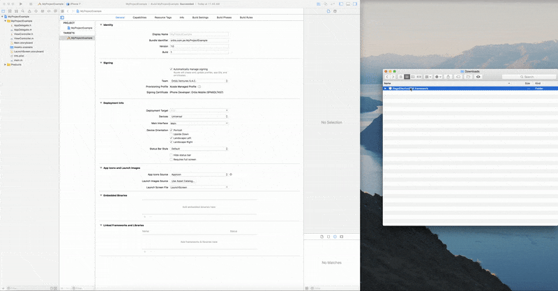

## **PagoEfectivo SDK para iOS**
----


### **Overview**
----

**PagoEfectivoSDK** le permitirá implementar de forma rápida y sencilla las funcionalidades que ofrece para realizar transacciones online a través de la plataforma de PagoEfectivo para iOS.

En el siguiente manual encontrará todo lo necesario para poder realizar la implementación del SDK, así como la forma correcta de implementar sus principales funciones tales como **Generar un CIP** y **Listar CIPs**.

### **Pre requisitos**
----
* [Xcode 8+](https://developer.apple.com/xcode/)
* iOS 10+

### **Instalación**
----
Es recomendable usar **CocoaPods** para instalar el SDK:

#### **Vía CocoaPods**
Es necesario tener instalado el gestor de paquetería, para ello debes ir a  [la página web de cocoapods](https://cocoapods.org/), instalar CocoaPods y luego puedes continuar con los siguientes pasos.

**Paso 1:**
Vía terminal, ubicarse en la carpeta del proyecto, donde se encuentra el archivo de extensión **.xcodeproj**

**Paso 2:**
Una vez ubicado en la carpeta del proyecto, ejecutar el siguiente comando:
```bash
$ pod init
``` 

**Paso 3:**
Agrega la siguiente línea de código al archivo **Podfile**:
``` 
#!ruby
pod "PagoEfectivoSDK"
```

**Paso 5:**
Instala el pod y abre el archivo de extensión **.xcworkspace**:
```bash
$ pod install
$ open yourProject.xcworkspace
```

#### **Vía manual**
**Paso 1:**
Descargar el archivo [**PagoEfectivoSDK.framework**](https://goo.gl/)

**Paso 2:**
Abrir tu proyecto con Xcode y agregar el archivo a las secciones **Embedded Binaries** en el target principal de tu proyecto

Aquí te dejamos un ejemplo de cómo debe agregarse de forma manual:


### **Configuración**
----
Para poder hacer uso del SDK es necesario configurar nuestro proyecto según el lenguaje.
A continuación te mostramos como hacerlo con Objective-C o Swift:

#### Objective-C
Para hacer uso de los métodos del SDK de PagoEfectivo bajo un proyecto en **Objective-C**, 
debes importar el módulo de PagoEfectivoSDK en el archivo **AppDelegate.m** del proyecto:

```
#!obj-c
#import <PagoEfectivoSDK/PagoEfectivoSDK.h>
```

#### Swift

Crear el archivo **_MyProject_-Brigding-Header.h**, y establecer la ruta de este archivo en la directiva **Objective-C Bridging Header** que se encuentra en la sección **Build Settings** en el _target_ principal del proyecto.

**Paso 1:**
En el archivo **_MyProject_-Brigding-Header.h** agregar lo siguiente:

```
#!obj-c
#import <PagoEfectivoSDK/PagoEfectivoSDK.h>
```

**Paso 2:**
En el archivo **AppDelegate.swift** agregar lo siguiente:
```
#!swift
import PagoEfectivoSDK
```

### **Inicialización**
----
Para poder hacer uso de las funciones que ofrece el SDK, es necesario inicializar la librería. 
Para ello debes tener estos valores previamente:

* Service Id
* Access Key
* Secret Key

!!! info
    Si aún no tienes los valores correspondientes favor de comunicarte [aquí](mailto:feedback@pagoefectivo.pe).

#### Objective-C
Se debe agregar el siguiente código  en el método **application** que se encuentra en el archivo **AppDelegate.m**:
```
#!obj-c
[PagoEfectivoSDK config: @"MY_SECRET_KEY"
                  accessKey: @"MY_ACCESS_KEY"
                  serviceId: MY_SERVICE_ID ];
```

#### Swift
Se debe agregar el siguiente código en el método **application** que se encuentra en el archivo **AppDelegate.swift**:
```
#!swift
PagoEfectivoSDK.config("MY_SECRET_KEY", 
    accessKey: "MY_ACCESS_KEY", 
    serviceId: MY_SERVICE_ID)
```

## **Funcionalidades del SDK**
----
El SDK provee las siguientes funcionalidades:


### **Generación de CIP**
----

#### Objective-C
```
#!obj-c
//Creamos una nueva instancia de tipo CipRequest
CipRequest *request = [CipRequest alloc];

//Se establecen las propiedades  requeridas
[request setAmount:100.05];
[request setCurrency: USD];
[request setTransactionCode:@"101"];
[request setUserEmail:@"jhon@doe.com"];

//Opcionales
[request setAdminEmail:@"foo@bar.com"];
[request setDateExpiry:@"2000-01-31T05:40:00-05:00"]; //Debe ingresarse en formato UTC
[request setPaymentConcept:@"Pago en tienda"]; //El concepto de pago
[request setAdditionalData:@"Se realizó un pago ... "]; //Data adicional
[request setUserName:@"jhon"];
[request setUserLastName:@"doe"];
[request setUserUbigeo:@"010101"]; //Formato
[request setUserCountry:@"PERU"];
[request setUserDocumentType: .DNI]; //El SDK provee una colección de tipos de documentType
[request setUserDocumentNumber:@"00000000"]; //Por ejemplo el formato de DNI
[request setUserPhone:@"999999999"];
[request setUserCodeCountry:@"+51"];

//Creamos una variable que almacene nuestra función que irá de callback para el servicio
serviceCallback __block callbackResponse = ^(long status, id receivedData, NSError *error){
        //Código para tratar con la respuesta
};

//Usamos la función de generación de CIP del SDK
[[PagoEfectivoSDK Cip] generate:EN 
                  requestObject:instanceRequest 
                responseHandler:callbackResponse];
```

#### Swift
```
#!swift
//creamos una nueva instancia de tipo CipRequest
let request = CipRequest()
request.amount = 100.05
request.currency = .PEN
request.transactionCode = "101"
request.userEmail = "jhon@doe.com"

//Opcionales
request.adminEmail = "foo@bar.com"
request.dateExpiry = "2000-01-31T05:40:00-05:00" //Debe ingresarse en formato UTC
request.paymentConcept = "Pago en tienda" //El concepto de pago
request.additionalData = "Se realizó un pago ... " //Data adicional
request.userName = "jhon"
request.userLastName = "doe"
request.userUbigeo = "010101" //Formato
request.userCountry = "PERU"
request.userDocumentType = .DNI //El SDK provee una colección de tipos de documentType
request.userDocumentNumber = "00000000" //Por ejemplo el formato de DNI
request.userPhone = "999999999"
request.userCodeCountry = "+51"

// Usamos la función de generación de CIP del SDK
PagoEfectivoSDK.cip().generate(.EN, 
    requestObject: request,
    responseHandler: { (status, result, error) in
        //Código para tratar con la respuesta del servicio
})
```

### **Consultar CIP(s)**
----

#### Objective-C
```
#!obj-c
//Definimos un arreglo
NSArray *cips = @[@"2495383",@"50",@"10"];

//Usamos la función de búsqueda de CIPs del SDK
[[PagoEfectivoSDK Cip] search:cips 
              responseHandler:^(long status, NSMutableArray *cipSearchArray, NSError *error) {
     //Código para tratar con la respuesta del servicio
}];
```


#### Swift
```
#!swift
//Definimos un arreglo
let cips:[String] = ["2495383", "50", "10"];

//Usamos la función de búsqueda de CIPs del SDK
PagoEfectivoSDK.cip().search(cips, 
    responseHandler: { (status, resul, error) in
        //Código para tratar con la respuesta del servicio
})
```

!!! info
     [La documentación de código](http://google.com) esta disponible para revisar a más detalle las funciones presentadas en esta documentación.

### **Feedback**
----

En caso existan dudas, consultas o mejoras en la guía, favor de escribir al [correo de feedback](mailto:feedback@pagoefectivo.pe)
con el asunto **Documentación PagoEfectivoSDK.**
